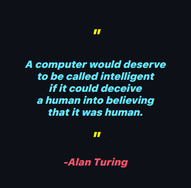

  <h1>Hi👋, I'm <strong>Alejandro Mejía</strong></h1>
  <h2>🧑‍💻 "discipline and perseverance are part of my daily life." 🧑🏻‍💻</h2>
  

  
<b>Profile Views</b>

  

<h2></h2>

<h2 align="center"> About me! </h2> 

-   👨‍💻 I'm Alejandro Mejía(Alejandrox27)👋, I'm currently studying programming by myself with online courses and the National Univertity of Colombia.    

-   💻 I'm currently studying python for machine learning    

-   🚀 2024 Goals: Learn C++ and be an expert in machine learning and AI   

-   📧 How to reach me **alej.mejia89@gmail.com**   

-   ☕ Interest: Science, Math and Coding.    

-    Hobbies: Studying english, Reading.   

<h2></h2>

  <h2></h2>
  <h3> <strong> Languages, Frameworks, and Tools </strong></h3>
  
    
  <h2></h2>
  <h3> <strong> Actively Learning </strong></h3>
  

 

  <h2> <strong> 📚 Education </strong></h2>
   

  

  

  
  
  
  

 

  <h2> 🏆 My Github Stats</h2> 
    <h2></h2> 

  
  
  
  
  

  

  

  <h2 align="center">👨‍💻 Top Projects</h2> 
  
  
  
  
  
  
  
  

  

  <h2 align="center">✉️ Contact</h2>
  
  &nbsp
  
  &nbsp

<!--
**Alejandrox27/Alejandrox27** is a ✨ _special_ ✨ repository because its `README.md` (this file) appears on your GitHub profile.

